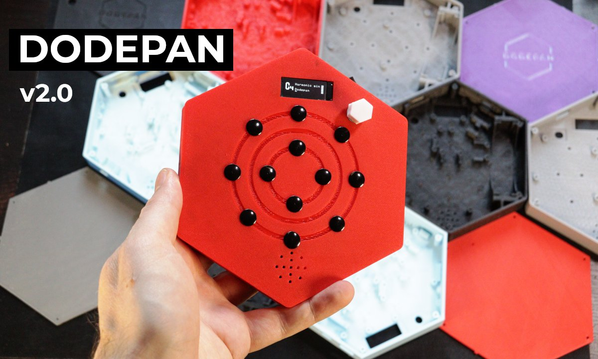
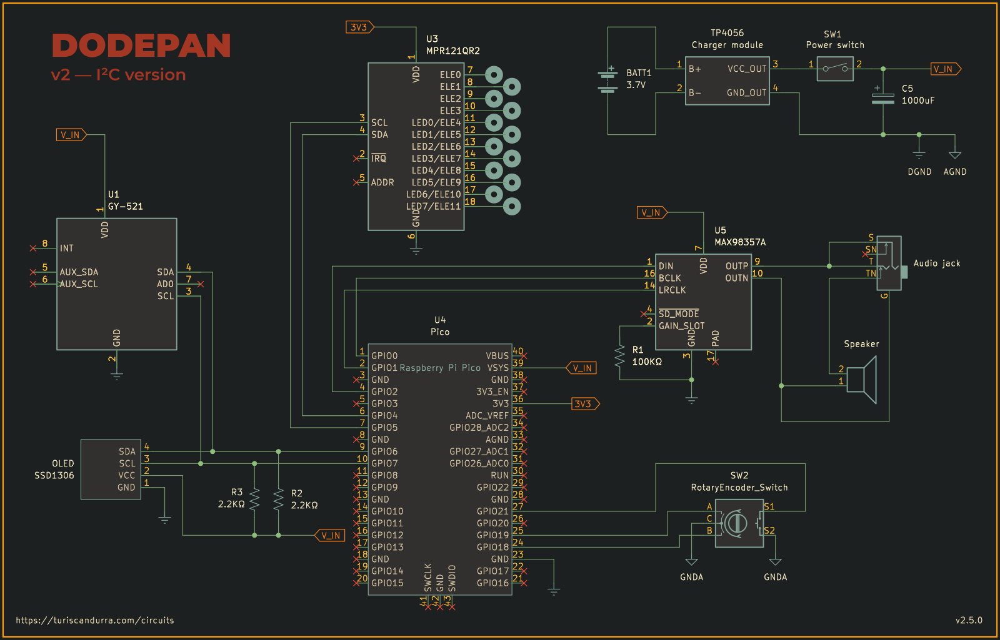

# Dodepan ­— Digital Synth and Midi controller

This repository contains the firmware and construction files for Dodepan, a portable electronic musical instrument and Midi controller that features a built-in synthesizer, looper, and expressive modulation.

## Overview

[](https://youtu.be/9P0qgh-Bno8 "Dodepan")
[Video link](https://youtu.be/9P0qgh-Bno8)

Dodepan is played by tapping on its twelve (_dodeka_ in Greek) capacitive metal pads. The instrument features I²S audio output, a rotary encoder for parameter selection, an SSD1306 OLED display, and an MPU-6050 IMU for velocity and pitch bending data.

## What's New

Compared to the original version, this iteration offers several improvements:

* Raspberry Pi Pico 2 as the central unit
* Better audio quality using an I²S DAC and power amplifier
* An SSD1306 OLED display
* A rotary encoder for navigation and parameter selection
* Direct digital synthesis engine
* 9 instrument presets, plus 4 slots for user presets
* Filter cutoff frequency modulation controlled by device tilt
* Sequence looper with diatonic transport selector
* Volume control
* Extended note range
* Automatic storage and retrieval of last used settings
* Fewer components

Dodepan v2 also sports an amplified output with speaker disable. While it can work fine with some headphones, the signal from the audio jack must be attenuated before being connected to sensitive equipment. A resistor between 1.2KΩ and 4.7KΩ is recommended.

## Synth engine and Instrument Parameters

The synth Dodepan is based on is [PRA32-U](https://github.com/risgk/digital-synth-pra32-u) by Ryo Ishigaki.
The instrument parameters section allows you to change the 46 parameters of the synthesizer. Press the encoder button to switch between parameter selection and value editing, and rotate the knob to change parameter or value. Long-press the encoder button to exit this section and store the current instrument to one of the four user presets.

## Looper

The looper section records note on/off events. To enable it, select the looper screen and press the encoder button. An empty square icon indicates no recording. Start playing a melody to automatically start recording. Press the encoder button to stop the recording and start playback. You can play on top of the looper. Press the button again to pause or restart playback. Rotate the encoder knob to perform diatonic transport of the recording.

## IMU Configuration

To make the instrument more expressive, an MPU-6050 IMU (Inertial Measurement Unit) is used to convert the intensity of a tap into velocity data, so that hard taps play louder and soft taps play quieter. The IMU also provides gyroscope data, which Dodepan uses to perform pitch bending, like in a previous toy synth I made, [TS-DET1](https://github.com/TuriSc/TS-DET1).

From the IMU config screen, you can enable or disable pitch bending and filter cutoff modulation when the Dodepan is tilted on the X and Y axes.

## Automatic Save

Dodepan automatically stores the current settings into its memory, with a configurable delay (default 10 seconds) to minimize flash wear. Stored settings are loaded automatically at startup.
The Pico onboard LED will flash briefly when data is being written to its flash memory.

## Built-in Scales

Sixteen built-in scales or modes are available:

* Major (ionian)
* Natural minor (aeolian)
* Harmonic minor
* Dorian
* Lydian
* Mixolydian
* Locrian
* Phrygian
* Phrygian dominant
* Pentatonic major (Diatonic)
* Pentatonic minor
* Pentatonic blues
* Arabian
* Oriental
* Japanese
* Chromatic

You can add up to four custom scales from the scale editing screen, which is accessed by long-pressing the rotary encoder switch while the current scale is selected.

## Secondary menu screens
A number of settings and features are accessible from secondary onboard menu screens.

| Selection  | On press                          | On long press                                      |
|------------|-----------------------------------|----------------------------------------------------|
| Key        | Enter key selection mode          | Display about screen                               |
| Scale      | Enter scale selection mode        | Enter scale edit screen (long press to exit)       |
| Instrument | Enter instrument selection mode   | Enter instrument edit screen (long press to exit)  |
| Volume     | Enter volume level selection mode | Enter display contrast selection screen            |
| Looper     | Activate, play/pause              | Exit looper screen                                 |
| IMU config | Enter IMU config mode             | Exit IMU config screen                             |

## Installation

To install the firmware, simply flash the provided uf2 file that matches your microcontroller (RP2040 for Raspberry Pi Pico and RP2350 for Raspberry Pi Pico 2). If you want to change any configuration options, you'll need to build the sources and generate your own uf2 file.

## Configuration

All user-configurable options are in the file [config.h](config.h). You can, for example, change pin numbers, MPR121 sensitivity, and timing-related values.

## Compiling

Building the sources requires the Raspberry Pi Pico SDK.

```
git clone https://github.com/TuriSc/Dodepan/
cd Dodepan
git submodule update --init --recursive
mkdir build && cd build
cmake -DPICO_PLATFORM=rp2350 ..
make
```

If you are compiling for RP2040, omit the PICO_PLATFORM directive:
```
cmake ..
make
```
A Raspberry Pi Pico (RP2040) will work but with some limitations. Polyphonic instruments might crackle a bit. To mitigate this, set the Voice Mode parameter to 2 (monophonic).

## Bill of Materials

* Raspberry Pi Pico 2 (RP2350)
* MPR121 (touch sensor)
* GY-521 IMU (MPU-6050 breakout board)
* MAX98357 I²S DAC
* 100KΩ resistor
* 2x 2.2KΩ resistors (external I²C pullup resistors)
* 1000uF electrolytic capacitor (for decoupling, optional. A smaller value is fine)
* Rocker switch (12mm x 8mm hole size)
* 18650 Lithium battery
* One pair of springs for 18650 battery
* TP4056 (charger module)
* SSD1306 0.91" OLED display
* EC11 rotary encoder (12mm height recommended)
* Speaker (4Ω 3W recommended, but 8Ω 2W is fine too)
* 3.5mm audio jack (switched)
* Metal pushpins (to use as touch pads)
* Electrical wire (multi strand 26 AWG)
* M2x5mm screws (10x for the PCB version, 22x for handwired build)
* 3D-printed enclosure, lid, and encoder knob. Handwired build also needs a few small parts

## Schematic



[PDF version](hardware/Dodepan-schematic.pdf)

## Step-by-step assembly guide (PCB version)

See [hardware/assembly guide/README.md](hardware/assembly guide/README.md)

## Known bugs

- Playing multiple notes simultaneously while also turning the encoder knob can result in the OLED display glitching.


## More Information

Dodepan is an original project.
Δώδεκα (dodeka) means twelve in Greek. Pan is a reference to the handpan, the instrument that inspired the first version of Dodepan.
The source code for the first version can be found on the version_1 branch at [TuriSc/Dodepan](https://github.com/TuriSc/Dodepan/tree/version_1).  
Similar projects can be found on my blog: [turiscandurra.com/circuits](https://turiscandurra.com/circuits/)
