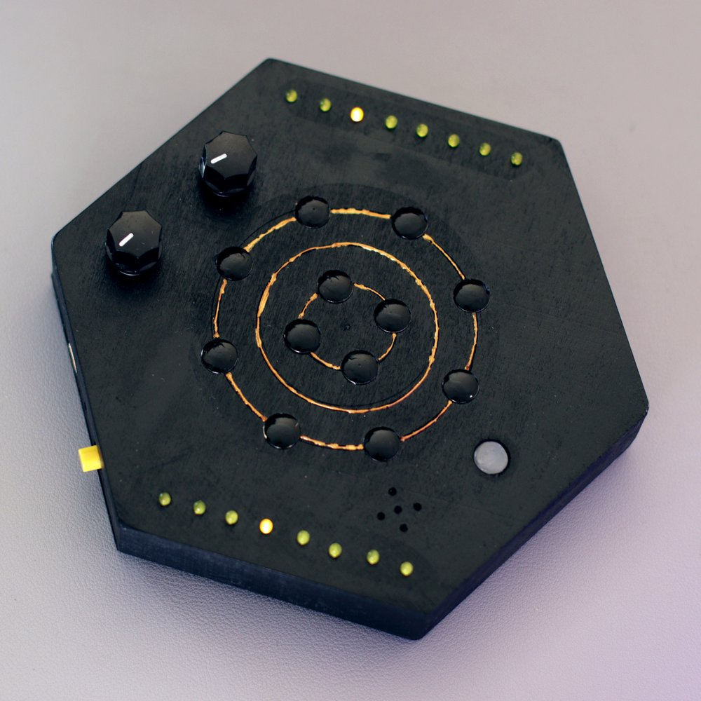
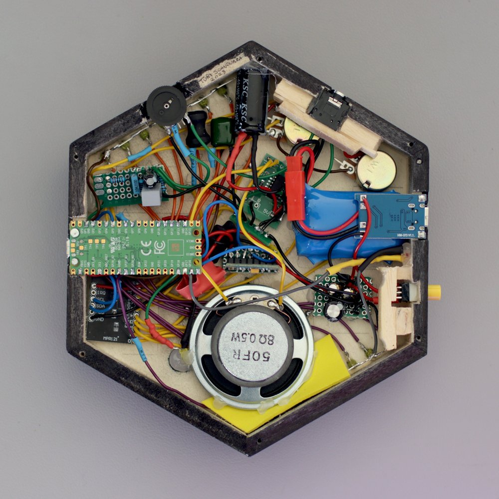
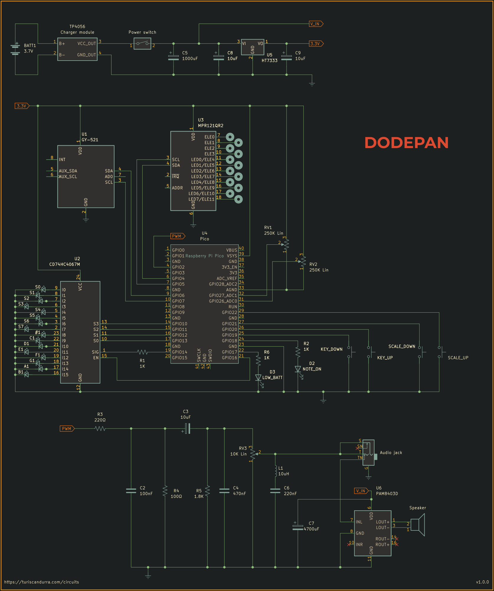

# Dodepan
## Digital musical instrument. Touch-enabled, with multiple tunings, pitch bending and Midi out.

Dodepan is a chromatic percussive instrument - like a lo-fi electronic version of a marimba or handpan.

[Demo video](https://youtu.be/QRPjRoQ2q2Q)



It's played by tapping on its twelve (_dodeka_ in Greek) capacitive metal pads. The lowest note it can produce is C2 (Midi number 36), the highest D8 (Midi number 110), so its chromatic range is 75 notes. One of its two knobs controls the current key (or root note), which ranges from C3 to B4. The other knob is used to select one of the sixteen scales available.
It's polyphonic, up to six concurrent voices (but more can be enabled in the settings).
Each one of the twelve pads is assigned to a note based on the current scale and key, following a zigzag layout and repeating notes at higher octaves when needed.

To make the instrument more expressive, an MPU-6050 IMU (Inertial Measurement Unit) is used to convert the intensity of a tap into velocity data, so that hard taps play louder and soft taps play quieter. In addition to the accelerometer, the IMU also provides gyroscope data, which Dodepan uses to perform pitch bending, a trick I borrowed from a previous toy synth I made, the [TS-DET1](https://github.com/TuriSc/TS-DET1).

The central unit of the circuit is a Raspberry Pi Pico. It aggregates and parses knob values and tap data from the MPR121 capacitive touch module, and displays taps, key and scale info via LEDs (through a 74HC4067 demultiplexer). Very importantly, the Pico outputs sound via pulse-width modulation. An analog circuit further processes the signal, acting as a digital-to-analog converter with volume control and noise suppression, before taking the sound to a PAM8403 amplifier that drives the built-in speaker.
There's also a headphone jack socket of the switched type, so when it's in use, the speaker is disabled.

When connected via USB to a computer or a Midi-compliant host instrument, Dodepan will show up as a Midi device, sending note events (note on with velocity, and note off) and pitch wheel modulation data.

The original note samples are a combination of synthesized marimba and balafon samples, and were created in [MusE Sequencer](https://github.com/muse-sequencer/) using DeicsOnze, an emulator of the Yamaha YM2414, the FM sound chip powering the Yamaha DX11 and TX81Z synthesizers.
They have been resampled to 22050Hz and their resolution lowered to 8bit (using dithering), before converting them to header files using [wav2c](https://github.com/olleolleolle/wav2c).

Everything is powered by a 3.7V li-ion battery, recharged by a TP4056 module via USB-C. An HT7333-A LDO is in place to make sure that the circuit never gets more than 3.3V, with the exception of the amplifier, which is fed straight unregulated voltage with no sweetener.



### Installation
Pre-compiled builds for Raspberry Pi Pico (RP2040) and Raspberry Pi Pico 2 (RP2350) are provided, they're in [/dist](dist).
Assuming you didn't make any changes to the circuit, you can simply flash the correct firmware. If, on the other hand, you need to change your configuration, you'll have to build the project from these sources.

### Configuration and building
It's important to check the file config.h and make sure you have enabled the modules you intend to use and disable the ones you don't.
Specifically, comment out the lines defining either USE_POTS or USE_BUTTONS according to your setup.

If you're cloning this repository, remember to initialize its submodules before compiling:
```shell
git submodule update --init --recursive
```

These are the dependencies:
- https://github.com/antgon/pico-mpr121
- https://github.com/TuriSc/RP2040-PWM-DMA-Audio
- https://github.com/TuriSc/RP2040-Button (required only if using buttons)
- https://github.com/TuriSc/RP2040-Moving-Average (required only if using potentiometers)
- https://github.com/HumansAreWeak/rpi-pico-mpu6050 (required only if using the IMU)

### Circuit BOM
Many of these components are optional. A minimal build requires only the Pico, the MPR121, the speaker and an amplifier or buffer.
- Raspberry Pi Pico
- MPR121 touch sensor
- CD74HC4067M multiplexer/demultiplexer
- MPU-6050 IMU (I used a module called GY-521)
- 4x momentary switches
- Latching power switch
- 18x LEDs 
- Lithium battery (ideally over 1000mAh)
- TP4056 charger module
- 100Ω resistor
- 2x 220Ω resistors
- 1K resistor
- 1.8K resistor
- 2x 250K linear potentiometers
- 10K linear potentiometer
- 100nF capacitor
- 470nF capacitor
- 220nF capacitor
- 3x 10uF electrolytic capacitors
- 1000uF electrolytic capacitor
- 4700uF electrolytic capacitor
- 10uH inductor
- HT7333 3.3V linear regulator
- PAM8403D audio amplifier
- 8Ω speaker
- 3.5mm audio jack (switched)
- Metal pushpins (to use as touch pads)

### Schematic


### Built-in scales
Sixteen scales are available:
- Major (ionian)
- Natural minor (aeolian)
- Harmonic minor
- Dorian
- Lydian
- Mixolydian
- Locrian
- Phrygian
- Phrygian dominant
- Pentatonic major (Diatonic)
- Pentatonic minor
- Pentatonic blues
- Arabian
- Oriental
- Japanese
- Chromatic

It's easy to change the existing ones or add more.

### A note about sound quality
The memory limitations of the Raspberry Pi Pico require the samples to be reduced to 8-bit, which makes them noisy – there's no way around that. An LC filter, formed by the inductor and the 220nF cap, helps to partly reduce the hiss introduced by downsampling and dithering of the audio sources. Further improvement comes from the very large cap, also required to stabilize the PAM8403D (which will stutter without it).

### More info
Pictures of alternative builds and the construction process are available on my blog: [turiscandurra.com/circuits](https://turiscandurra.com/circuits/)
